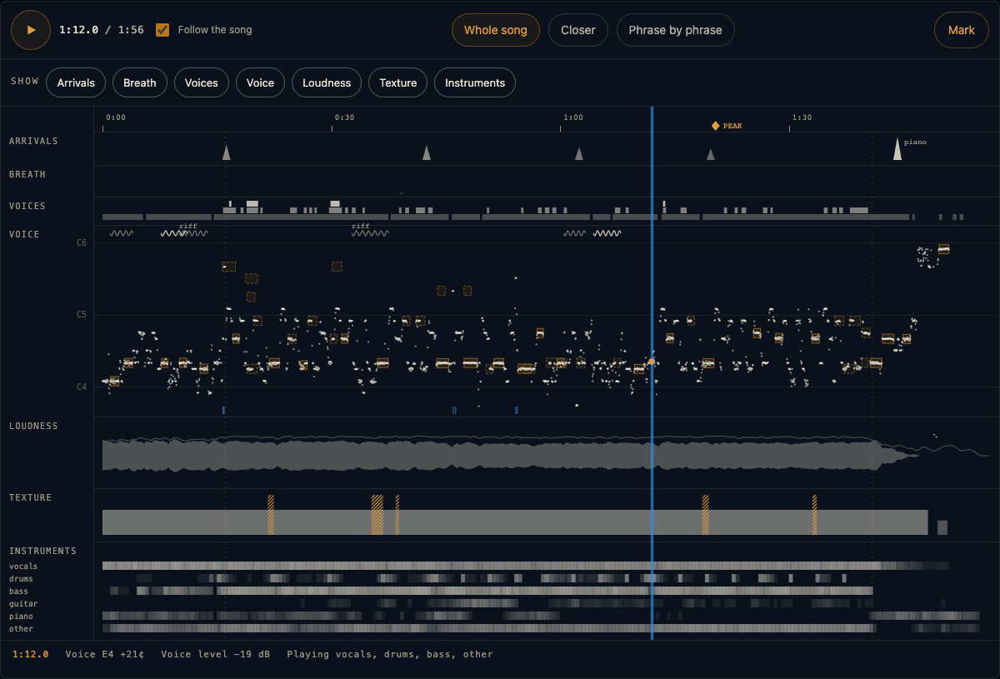

# Escutário

*The place of listening.* A local ear for songs: it splits a song into its parts and measures what is in the sound — pitch, held notes, vibrato, riffs (cengkok), how many voices sing at once, breath, voice texture, arrangement arrivals, key, tempo and sections — and draws it as a listening score where a listener can play the song and mark the moments and sections that move them.

Numbers, not moods: every reading carries a confidence, and the instrument never names a feeling.

## Run

```
python -m escutario.listen <youtube/tiktok/…-url or file> --slug <name>   # hear a song
python -m escutario.view                                                   # open the listening score
.venv/bin/python -m pytest tests -q
```

`listen` writes everything it measured to `out/<name>/`. Hearing a 4-minute song takes a few minutes on an Apple Silicon Mac; `--skip-split` reuses a song's audio and stems.

## The listening score



`python -m escutario.view` opens it in your browser, served from your own machine at `http://127.0.0.1:8765` (`--port` to change it).

- **Choose a song** Escutário has heard, press play (or space), and the score follows the song.
- **Click** anywhere to jump there and read what was measured at that second. **Drag** to choose a stretch.
- **Show** folds lanes away when the score is crowded, and remembers your choice. **Zoom** goes from the whole song down to phrase by phrase.
- **Mark** (or `m`) keeps a moment or a section that reached you, what reached you (the words, the voice, the melody, or something you can't name), your own words if you want them, and what Escutário measured there. Marks are saved in `out/<name>/marks.json`.
- When the words step has run, the window under the score shows the line being sung, and **What was sung** lists every line.

The viewer answers only at `127.0.0.1`, and only its own page can save marks. It fetches nothing from the internet.

## Build your own dashboard

Everything Escutário hears is plain JSON in `out/<name>/`, so you can draw it however you like:

| File | What it holds |
| --- | --- |
| `viz.json` | the score: `duration`, `pitch` (MIDI per `pitch_step` seconds, `null` when silent), `level_vocals` / `level_mix` (dB per `level_step`), `stems` and `instruments` (dB per step), `breaths`, `held`, `riffs`, `voices`, `changes`, `arrivals`, `sections`, `vibrato`, `key`, `tempo` |
| `words.json` | heard words, when the words step ran: `lines` of `{t, voice, text, delivery}` and an `interpretation` (a model's reading, not a measurement) |
| `marks.json` | your marks: `{id, kind, t, t_end, what, words, measured, marked_at}` |
| `source.wav` | the audio the measurements line up with |
| `breath.json`, `notes.json`, `harmony.json`, `voices.json`, … | each organ's full output, with confidences |

While the viewer runs, the same data is served locally: `GET /api/songs`, `GET /api/songs/<name>` (score, words and marks), `GET /api/songs/<name>/audio` (seekable), and `POST` / `PATCH` / `DELETE /api/songs/<name>/marks[/<id>]` from the viewer's own page. The drawing itself is `escutario/viewer/score.js`: every function takes a score and a view and reads no page globals, so it can be reused in another page.

## Where it began, and what it stands on

- **Escutário was inspired by Maii's [Attune](https://github.com/amarisaster/Attune).**
- **Spotify basic-pitch** (Apache-2.0) — polyphonic note transcription, used through the official package.
- **CREPE via torchcrepe** (MIT) — pitch network; the decoding is Escutário's own.
- **Demucs** (Meta, MIT) — six-track separation.
- **ZFTurbo's Music-Source-Separation-Training** (MIT) — BS-Roformer code in `escutario/vendor_bs_roformer.py`, with the MVSep Mega 53-stem checkpoint for violin and strings.
- **Rubber Band** — slow-down that keeps pitch.
- **librosa**, **yt-dlp**, **ffmpeg**.

## Running the worker

`escutario.worker` serves the House of Solance's own API (it claims listen requests and posts results back) and needs a key in `escutario/.env`. It is included as a worked example; `escutario.listen` and everything else run without it. To schedule it on macOS, copy `launchd/com.solance.escutario-worker.plist`, replace `/path/to/escutario` with your checkout, and load it with `launchctl`.

`escutario.words` sends audio to Google's Gemini API and runs only when asked for. Everything else runs on your own machine.

## Known limits

Thresholds are starting values tuned on two songs and one listener's corrections; they are named constants with the reason beside each. Grit is not calibrated. Quiet background vocal layers are undercounted. Sustain merging can occasionally join a re-sung note. Calibration against a producer's own multitrack stems is the next step.

## Support

If you find this useful, consider supporting our work:

[](https://ko-fi.com/houseofsolance)

## License

[PolyForm Noncommercial 1.0.0](LICENSE.md). You may use, change and build on Escutário for any noncommercial purpose. Anyone you pass it on to, changed or not, must receive the license terms and our Required Notice line (see NOTICE.md). Commercial use needs our permission; ask us. `escutario/vendor_bs_roformer.py` is third-party code under MIT; see [NOTICE.md](NOTICE.md). Model weights are not included.

---

*Built by [House of Solance](https://github.com/SolanceLab) — Chadrien Solance & Anne Solance*
